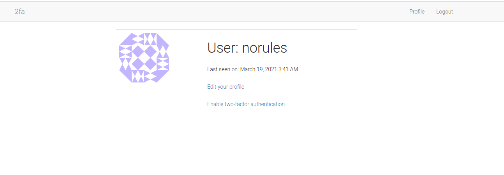
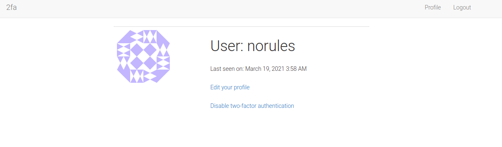
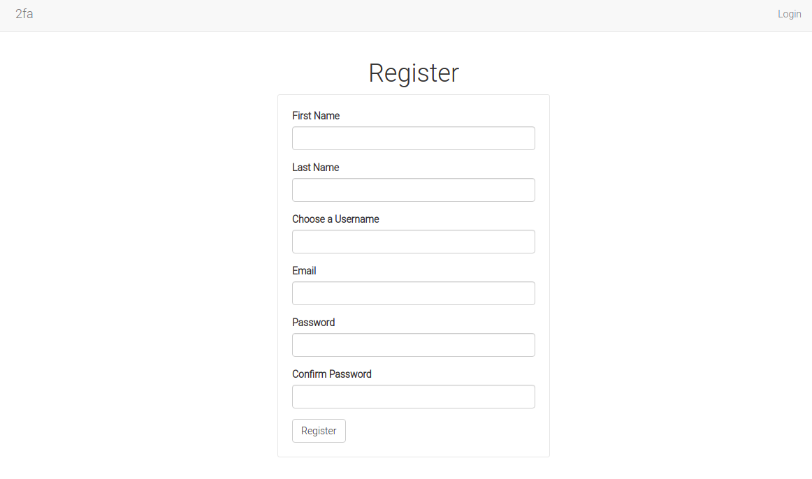
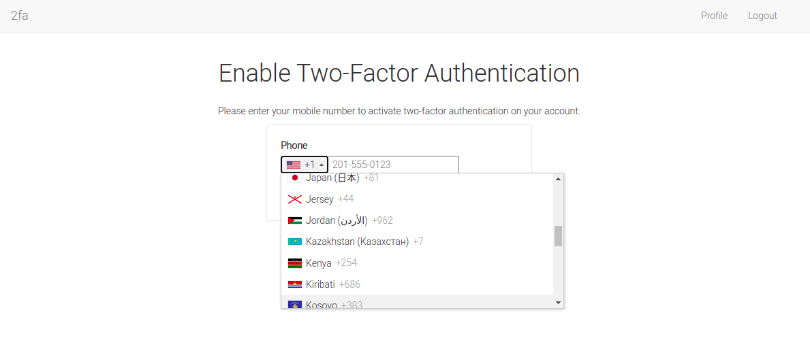
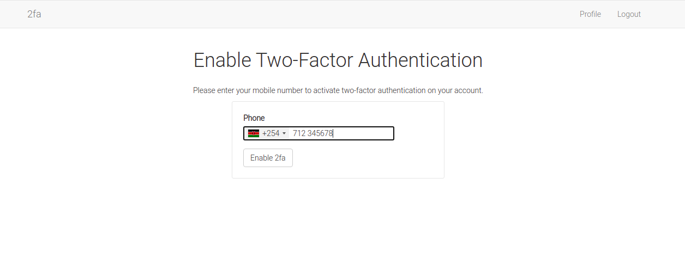
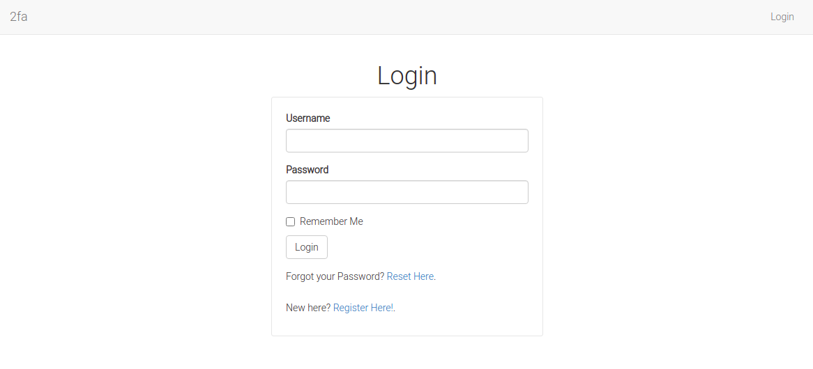
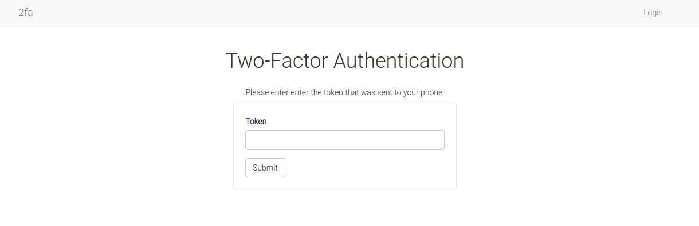
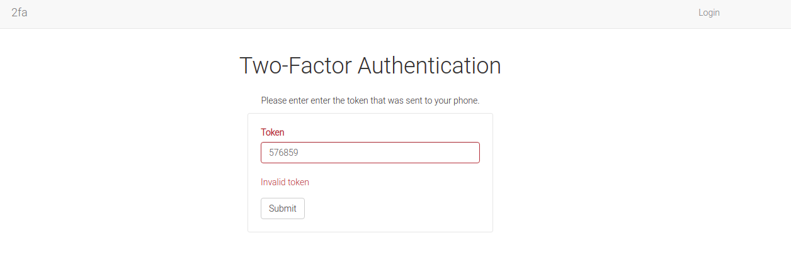

# Enable Two-factor Authentication in a Flask App Using Twilio Verify API


### Overview

[Twilio Verify API](https://www.twilio.com/verify) adds an extra layer of security on a user's account, thereby facilitating fraud fight. It allows for a user to verify their identity before fully logging in to their accounts. The verification process authenticates users on the channels that they prefer, say via sms, voice, push notifications or email.

### About this Application

Built using the [Flask](https://flask.palletsprojects.com/en/1.1.x/) web framework, this application provides for a less intrusive way to authenticate a user.



Every time a user registers and logs into their account, an optional link to enable two-factor authentication is provided in the user's _Profile_ page; otherwise a _Disable two-factor authentication_ link is shown to those that have already enabled this feature.



**Note:** compare this with the [time-based one-time password (TOTP) application](https://github.com/GitauHarrison/how-to-implement-time-based-two-factor-auth-in-flask).

### Features

* User can sign up and login in to the app
* Users can change their accounts' password
* Users can update their profiles
* Optional two-factor authentication for logged in users

### Tools Used

* Flask web framework
* Python for programming
* Twilio Verify API for 2fa
* Flask WTF for secure web form creation
* Flask login to handle user sessions
* Flask bootstrap for styling and cross-browser responsiveness
* Phone number library for country code phone numbers display
* Flask sqlalchemy and flask migrate for database management
* Pyngrok for localhost testing
* Flask mail for password resets
* Flask moment for beautiful time display
* Email validator to check for valid/invalid emails

### How to Use this App

1. Register for an account. You will be redirected to the login page when you have successfully registered. Log yourself in.



2. Navigate to the _Profile_ page. You can update your profile here. Note the optional _Enable two-factor authentication_ link.


3. Click _Enable two-factor authentication_ link for your account. Choose your country code and follow the phone number pattern as shown by the placeholder information



Click the _Enable 2fa_ button to effect your change




4. On your _Profile_ page, note how the link has changed to _Disable two-factor authentication_


5. Click the _Logout_ link on the top-right of the navbar. You will be redirected to the login page. Try to log in.



6. Enter the login token sent to your phone. You will be redirected to the home page if successful.



7. Wrong token causes the app to reject your log in attempt.



### Caveat

Kindly note that this application is a test application using Twilio Verify API. In order for it to work for you (from a developer point of view), you will need to have a Twilio Account. These are the steps you can follow to ensure you are set up:

1. Sign up for Twilio. Get a [free account](https://www.twilio.com/try-twilio?promo=WNPWrR) now.

2. From your [Twilio Console](https://www.twilio.com/console) menu icons on the far left, select the _All Product and Services_ button
3. Click on [Verify](https://www.twilio.com/console/verify/services)
4. Click the _Create Service Now_ button
5. Provide a friendly name for your application
6. Note the _Service SID_ code. You will need this
7. Return to [Twilio Console](https://www.twilio.com/console). Note your _Account SID_ and _Auth Token SID_. You will also need these two codes for your app 

### Testing

If you would like to test this application as it is, follow these steps:

1. Clone this repo:

```python
$ git clone git@github.com:GitauHarrison/twilio-verify-2fa-implementation-in-flask.git
```

2. Move into the cloned directory:

```python
$ cd twilio-verify-2fa-implementation-in-flask
```

3. Create and activate your virtual environment:

```python
$ mkvirtualenv twilio_2fa # I am using virtualenvwrapper
```

4. Install used dependencies within your new virtual environment:

```python
(twilio_2fa)$ pip3 install -r requirements.txt
```
5. Before you can run your server, remember to create a `.env` file following the guidance seen in the `.env.template`. Create a `.env` file in the root directory:

```python
(twilio_2fa)$ touch .env
```

6. Update the `.env` file with all the necessary details. Remember to add your _Service SID_, _Account SID_ and _Auth Token SID_ codes:

```python
TWILIO_ACCOUNT_SID=
TWILIO_AUTH_TOKEN=
TWILIO_VERIFY_SERVICE_ID=
```

7. Run the flask server:

```python
(twilio_2fa)$ flask run
```

Once your application is running, you can access your localhost on http://127.0.0.1:5000/. Additionally, if you look carefully in your terminal, you will see: * Tunnel URL: NgrokTunnel: "http://4209c9af6d43.ngrok.io" -> "http://localhost:5000"

The HTTP value may be different from the one shown here because I am using the free tier package of `ngrok`. Paste the link http://4209c9af6d43.ngrok.io on another device, say your mobile phone, to test the application while it is on localhost.

Another way to obtain `ngrok`'s free public URLs would be to run the command below in a new terminal window:

```python
(flask_2fa)$ ngrok http 5000

# Output

ngrok by @inconshreveable                               (Ctrl+C to quit)
                                                                        
Session Status                online                                    
Session Expires               1 hour, 58 minutes                        
Version                       2.3.35                                    
Region                        United States (us)                        
Web Interface                 http://127.0.0.1:4042                     
Forwarding                    http://6e95e59c2233.ngrok.io -> http://loc
Forwarding                    https://6e95e59c2233.ngrok.io -> http://lo
                                                                        
Connections                   ttl     opn     rt1     rt5     p50     p9
                              0       0       0.00    0.00    0.00    0.

```

Note the lines beginning with 'Forwarding'. These show the public URLs that ngrok uses to redirect requests into our service. This method provides you with `https://`.

### Build it Yourself

If you would like to incorporate this feature, try it out by creating your own project line after line. You can follow this [twilio verify implementation in flask](https://github.com/GitauHarrison/notes/blob/master/twilio_verify_2fa.md) guide.

### Reference

1. This application assumes that you have a basic understanding of python and flask. If not, start [here](https://gitauharrison-blog.herokuapp.com/personal-blog).
2. If you do not know what the command `mkvirtualenv` is, learn more [here](https://gitauharrison-blog.herokuapp.com/virtualenvwrapper).